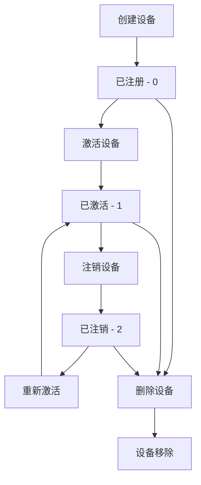

# 状态码说明文档

## API响应状态码

### code字段说明
API响应中的`code`字段表示请求的执行结果。

| 状态码 | 说明 | 处理建议 |
|--------|------|----------|
| 0 | 成功 | 正常处理返回数据 |
| 400 | 请求参数错误 | 检查请求参数格式和必填项 |
| 401 | 认证失败 | 检查API Key和签名算法 |
| 403 | 权限不足 | 确认API权限配置 |
| 404 | 资源不存在 | 检查设备ID或产品ID是否正确 |
| 500 | 服务器内部错误 | 稍后重试或联系技术支持 |
| 503 | 服务不可用 | 系统维护中，稍后重试 |
| 504 | 异步通讯 | 操作已提交，需要异步查询结果 |

### 错误响应示例

#### 参数错误 (400)
```json
{
  "code": 400,
  "msg": "参数验证失败：pageSize不能超过100",
  "result": null
}
```

#### 认证失败 (401)
```json
{
  "code": 401,
  "msg": "签名验证失败",
  "result": null
}
```

#### 设备不存在 (404)
```json
{
  "code": 404,
  "msg": "设备不存在：deviceId=invalid_device_id",
  "result": null
}
```

## 设备状态码 (deviceStatus)

### 状态值定义

| 状态码 | 状态名称 | 说明 | 可执行操作 |
|--------|----------|------|------------|
| 0 | 已注册 | 设备已在平台注册，但未激活 | 激活设备、更新信息、删除设备 |
| 1 | 已激活 | 设备已激活，可以正常通信 | 发送指令、查询数据、注销设备 |
| 2 | 已注销 | 设备已停用，无法通信 | 重新激活、删除设备 |

### 状态转换流程



### 状态检查代码示例

```javascript
function getDeviceStatusInfo(deviceStatus) {
    const statusMap = {
        0: {
            name: '已注册',
            description: '设备已注册但未激活',
            canActivate: true,
            canCommunicate: false,
            color: 'yellow',
            icon: '⏳'
        },
        1: {
            name: '已激活',
            description: '设备已激活，可正常通信',
            canActivate: false,
            canCommunicate: true,
            color: 'green',
            icon: '✅'
        },
        2: {
            name: '已注销',
            description: '设备已注销，无法通信',
            canActivate: true,
            canCommunicate: false,
            color: 'red',
            icon: '🚫'
        }
    };

    return statusMap[deviceStatus] || {
        name: '未知状态',
        description: '未知的设备状态',
        canActivate: false,
        canCommunicate: false,
        color: 'gray',
        icon: '❓'
    };
}
```

## 网络状态码 (netStatus)

### 状态值定义

| 状态码 | 状态名称 | 说明 | 检测机制 |
|--------|----------|------|----------|
| 1 | 在线 | 设备当前连接到平台 | 实时连接检测 |
| 2 | 离线 | 设备当前未连接 | 心跳超时检测 |
| null | 未知 | 状态未确定或从未连接 | 未建立连接 |

### 网络状态判断逻辑

```javascript
function analyzeNetworkStatus(device) {
    const { netStatus, onlineAt, offlineAt } = device;

    if (netStatus === null) {
        return {
            status: 'never_connected',
            message: '设备从未连接过',
            reliability: 'unknown'
        };
    }

    if (netStatus === 1) {
        const onlineDuration = onlineAt ? Date.now() - onlineAt : 0;
        return {
            status: 'online',
            message: `设备在线 (持续${formatDuration(onlineDuration)})`,
            reliability: 'high'
        };
    }

    if (netStatus === 2) {
        const offlineDuration = offlineAt ? Date.now() - offlineAt : 0;
        let reliability = 'medium';

        if (offlineDuration > 24 * 60 * 60 * 1000) { // 超过24小时
            reliability = 'low';
        }

        return {
            status: 'offline',
            message: `设备离线 (已离线${formatDuration(offlineDuration)})`,
            reliability
        };
    }

    return {
        status: 'unknown',
        message: '网络状态未知',
        reliability: 'unknown'
    };
}
```

### 连接质量评估

```javascript
function assessConnectionQuality(device) {
    const { onlineAt, offlineAt, createTime } = device;

    if (!onlineAt) {
        return { score: 0, grade: 'F', description: '从未连接' };
    }

    const totalTime = Date.now() - createTime;
    const onlineTime = onlineAt - createTime;
    const offlineTime = offlineAt ? Date.now() - offlineAt : 0;

    // 计算在线时长占比
    const onlineRatio = onlineTime / totalTime;

    // 计算稳定性（最近离线时长越短越好）
    const stabilityScore = Math.max(0, 1 - (offlineTime / (24 * 60 * 60 * 1000)));

    const score = (onlineRatio * 0.7 + stabilityScore * 0.3) * 100;

    let grade, description;
    if (score >= 90) {
        grade = 'A+';
        description = '连接质量优秀';
    } else if (score >= 80) {
        grade = 'A';
        description = '连接质量良好';
    } else if (score >= 70) {
        grade = 'B';
        description = '连接质量一般';
    } else if (score >= 60) {
        grade = 'C';
        description = '连接质量较差';
    } else {
        grade = 'D';
        description = '连接质量很差';
    }

    return { score: Math.round(score), grade, description };
}
```

## 协议状态码 (productProtocol)

### 协议分类

| 协议值 | 协议名称 | 分类 | 特点 |
|--------|----------|------|------|
| 1 | T-LINK | 电信专有 | 低功耗、高可靠 |
| 2 | MQTT | 标准协议 | 实时性好、广泛支持 |
| 3 | LWM2M | 物联网标准 | 适合NB-IoT、资源管理 |
| 4 | TUP | 电信统一 | 电信定制、功能完整 |
| 5 | HTTP | Web标准 | 简单易用、调试方便 |
| 6 | JT/T808 | 行业标准 | 车载专用、监管合规 |
| 7 | TCP | 传输协议 | 可靠传输、自定义格式 |
| 8 | 私有TCP | 网关子协议 | 网关管理、批量接入 |
| 9 | 私有UDP | 网关子协议 | 快速传输、简单协议 |
| 10 | 网关MQTT | 网关协议 | MQTT网关、设备聚合 |
| 11 | 南向云 | 云端协议 | 云云对接、数据同步 |

### 协议能力矩阵

```javascript
const protocolCapabilities = {
    1: { // T-LINK
        realTime: true,
        lowPower: true,
        largeData: false,
        security: 'high',
        complexity: 'medium'
    },
    2: { // MQTT
        realTime: true,
        lowPower: true,
        largeData: true,
        security: 'medium',
        complexity: 'low'
    },
    3: { // LWM2M
        realTime: false,
        lowPower: true,
        largeData: false,
        security: 'high',
        complexity: 'high'
    },
    6: { // JT/T808
        realTime: true,
        lowPower: false,
        largeData: true,
        security: 'high',
        complexity: 'high',
        regulatory: true
    }
    // ... 其他协议
};

function getProtocolRecommendation(useCase) {
    const recommendations = {
        'real-time-monitoring': [2, 1, 7],     // MQTT, T-LINK, TCP
        'battery-powered': [3, 1, 2],          // LWM2M, T-LINK, MQTT
        'vehicle-tracking': [6],                // JT/T808
        'web-integration': [5, 2],             // HTTP, MQTT
        'massive-deployment': [3, 8, 9]        // LWM2M, 私有TCP/UDP
    };

    return recommendations[useCase] || [2]; // 默认推荐MQTT
}
```

## 错误处理最佳实践

### 1. 重试策略

```javascript
class AEPRetryHandler {
    constructor(maxRetries = 3, baseDelay = 1000) {
        this.maxRetries = maxRetries;
        this.baseDelay = baseDelay;
    }

    async executeWithRetry(operation, context = {}) {
        let lastError;

        for (let attempt = 1; attempt <= this.maxRetries; attempt++) {
            try {
                const result = await operation();
                if (result.code === '0') {
                    return result;
                }

                // 根据错误码决定是否重试
                if (this.shouldRetry(result.code, attempt)) {
                    await this.delay(this.calculateDelay(attempt));
                    continue;
                } else {
                    throw new Error(`API Error: ${result.code} - ${result.msg}`);
                }
            } catch (error) {
                lastError = error;
                if (attempt === this.maxRetries) break;
                await this.delay(this.calculateDelay(attempt));
            }
        }

        throw lastError;
    }

    shouldRetry(errorCode, attempt) {
        // 这些错误码不应重试
        const noRetryErrors = [400, 401, 403, 404];
        if (noRetryErrors.includes(parseInt(errorCode))) {
            return false;
        }

        // 服务器错误可以重试
        return [500, 503].includes(parseInt(errorCode)) && attempt < this.maxRetries;
    }

    calculateDelay(attempt) {
        // 指数退避策略
        return this.baseDelay * Math.pow(2, attempt - 1);
    }

    delay(ms) {
        return new Promise(resolve => setTimeout(resolve, ms));
    }
}
```

### 2. 状态监控

```javascript
class DeviceStatusMonitor {
    constructor() {
        this.statusHistory = new Map();
    }

    recordStatus(deviceId, status) {
        if (!this.statusHistory.has(deviceId)) {
            this.statusHistory.set(deviceId, []);
        }

        const history = this.statusHistory.get(deviceId);
        history.push({
            status,
            timestamp: Date.now()
        });

        // 只保留最近100条记录
        if (history.length > 100) {
            history.shift();
        }
    }

    detectAnomalies(deviceId) {
        const history = this.statusHistory.get(deviceId) || [];
        if (history.length < 5) return [];

        const anomalies = [];
        const recent = history.slice(-10);

        // 频繁状态切换检测
        const transitions = recent.filter((record, index) => {
            if (index === 0) return false;
            return record.status !== recent[index - 1].status;
        });

        if (transitions.length > 5) {
            anomalies.push({
                type: 'frequent_transitions',
                severity: 'warning',
                description: '设备状态频繁切换'
            });
        }

        // 长时间离线检测
        const offline = recent.filter(r => r.status === 2);
        if (offline.length === recent.length) {
            const duration = Date.now() - recent[0].timestamp;
            if (duration > 24 * 60 * 60 * 1000) {
                anomalies.push({
                    type: 'long_offline',
                    severity: 'critical',
                    description: '设备长时间离线'
                });
            }
        }

        return anomalies;
    }
}
```

### 3. 状态码映射

```javascript
const StatusCodeMapper = {
    // HTTP状态码到中文描述的映射
    httpStatusMap: {
        200: '请求成功',
        400: '请求参数错误',
        401: '认证失败',
        403: '权限不足',
        404: '资源不存在',
        500: '服务器内部错误',
        503: '服务不可用',
        504: '请求超时'
    },

    // 设备状态码到操作建议的映射
    deviceActionMap: {
        0: ['activate', 'update', 'delete'],
        1: ['command', 'query', 'deactivate'],
        2: ['reactivate', 'delete']
    },

    // 获取用户友好的错误描述
    getErrorDescription(code, context = {}) {
        const descriptions = {
            400: `请求参数错误${context.field ? `：${context.field}` : ''}`,
            401: '认证失败，请检查API密钥和签名',
            403: '权限不足，请确认API权限配置',
            404: `${context.resource || '资源'}不存在`,
            500: '服务器内部错误，请稍后重试',
            503: '服务暂时不可用，系统可能正在维护'
        };

        return descriptions[code] || `未知错误：${code}`;
    }
};
```

---

*最后更新: 2024-12-29*
*版本: 1.0*