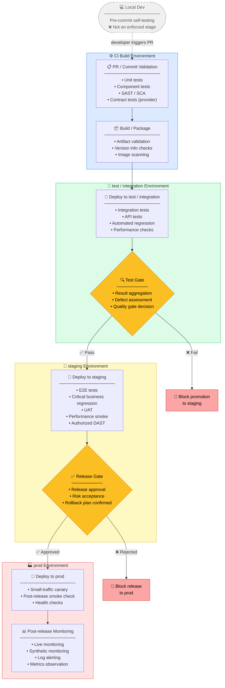

# BASF IRIS CI/CD Pipeline

## Pipeline Stage Overview

| Standard Stage               | Primary Environment  | QA / Quality Activities                                                                              | Stage Output                                                          |
| ---------------------------- | -------------------- | ---------------------------------------------------------------------------------------------------- | --------------------------------------------------------------------- |
| PR / Commit Validation       | CI Build Environment | Unit tests, component tests, SAST, SCA, contract tests (provider side)                               | Determine whether code can enter trunk or proceed to build            |
| Build / Package              | CI Build Environment | Artifact validation, version info checks, image scanning (if applicable)                             | Generate a traceable, deployable release candidate                    |
| Deploy to test / integration | test / integration   | Integration tests, API tests, automated regression, smoke regression, lightweight performance checks | Verify inter-service integration and core feature stability           |
| Test Gate                    | test / integration   | Test result aggregation, defect assessment, quality gate decision                                    | Decide whether to allow promotion to staging                          |
| Deploy to staging            | staging              | E2E, critical business regression, UAT, performance smoke, authorized DAST                           | Execute final pre-launch validation                                   |
| Release Gate                 | staging              | Release approval, risk acceptance, rollback plan confirmation                                        | Decide whether to allow release to prod                               |
| Deploy to prod               | prod                 | Small-traffic canary, post-release smoke check, health checks                                        | Confirm deployment success and that critical paths are available      |
| Post-release Monitoring      | prod                 | Live monitoring, synthetic monitoring, log alerting, metrics observation                             | Continuously confirm production stability and detect regression risks |

> `Local Dev` is a pre-commit self-testing step, not an enforced pipeline stage; the formal pipeline starts at `PR / Commit Validation` and progressively promotes to production monitoring.

---

## CI/CD Pipeline Flow Diagram

---

## Stage-by-Stage Summary

### 1. Local Dev *(pre-pipeline)*
Self-testing before committing. Not an enforced CI stage.

### 2. PR / Commit Validation *(CI Build)*
Gates code entering trunk. Runs unit, component, and security scans.

### 3. Build / Package *(CI Build)*
Produces the traceable release candidate artifact.

### 4. Deploy to test / integration *(test env)*
Validates inter-service integration and core feature stability.

### 5. Test Gate *(decision point)*
Aggregates test results. Blocks promotion to staging if quality bar is not met.

### 6. Deploy to staging *(staging env)*
Full-fidelity pre-production validation including UAT and DAST.

### 7. Release Gate *(decision point)*
Formal approval with rollback plan. Blocks release to prod if not approved.

### 8. Deploy to prod *(prod env)*
Canary rollout with smoke and health checks.

### 9. Post-release Monitoring *(prod env)*
Continuous stability confirmation and regression detection via live observability.
